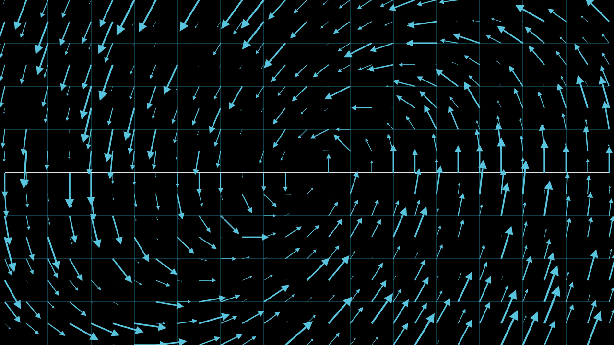
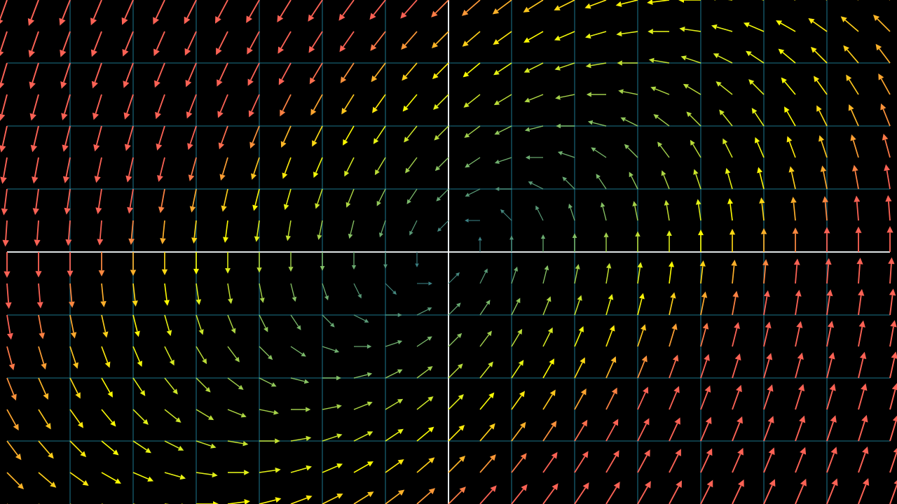

Welcome to our new series on Flow Matching, commonly referred to as Flow Models in the literature. Flow matching is a new generative modeling method that combines the advantages of Continuous Normalizing Flows (CNFs) and Diffusion models. If you are familiar with our DDPMs series, you'll recognize our approach: start with fundamental mathematical concepts and gradually build complexity. We will follow the same strategy in this series. This first post focuses on vector fields and velocity fields in detail. 

# Vector Fields

While vector fields are used to describe physical phenomena like electromagnetism, gravity, fluid flow, etc., our focus will be on their mathematical properties. Understanding the mathematics of vector fields will help you understand the terms in flow models much better. 

Strictly speaking, a vector field is a function mapping a d-dimensional input to a d-dimensional output where each point in this space is associated with a vector, and each vector has a magnitude and a direction associated with it. 

Here is how a vector field in 2D space looks like:

   

These vectors may represent anything in this space. For example, you can use these vectors to define the force of gravity at different points in this space. Depending on the quantity represented by these vectors, you can expect that the magnitude of these vectors differ for various points in this space. 

A practical consequence of this variability in magnitude is that vectors in visualizations are often not drawn to scale. Keeping the magnitude the same when drawing these vectors makes the visualization less cluttered and more aesthetically pleasing. Magnitude is critical information. Hence, people often use color codes to represent vectors of different magnitudes in the visualizations. Here is a simple demonstration:

  

# Velocity Field
You'll encounter the term 'velocity' frequently when learning about Flow Matching. A velocity field is a specific type of vector field. Imagine you are watching leaves floating down a river. At different points across the river's width, the leaves might be moving at different speeds and in slightly different directions. A velocity field is a mathematical way to describe this: it's a representation that shows how velocity changes across a spatial region. While velocity fields are commonly used in fluid dynamics, we'll focus on the intuition needed for flow models and avoid getting too deep into fluid mechanics.

Simply put, a velocity field describes how a point moves (direction and speed) in a spatial region over a given interval, say $t ∈ [0, 1]$. The velocity is not constant; it can change from point to point, illustrating flow patterns. This change in velocity across different locations is known as spatial variation.

But how or where is it used in flow models? We will talk about it in detail in the next chapter. It will be easier to connect the dots once you understand the other underlying concepts of flow models.

# References

- [Divergence and Curl](https://www.youtube.com/watch?v=rB83DpBJQsE&t=48s)
- [Velocity Fields](https://teaching.smp.uq.edu.au/scims/Adv_calculus/Velocity_field.html)
- [Vector Fields: An introduction](https://www.khanacademy.org/math/multivariable-calculus/thinking-about-multivariable-function/visualizing-vector-valued-functions/v/vector-fields-introduction)
- [Flow With What You Know](https://drscotthawley.github.io/blog/posts/FlowModels.html)
- [Vector Field](https://en.wikipedia.org/wiki/Vector_field)

